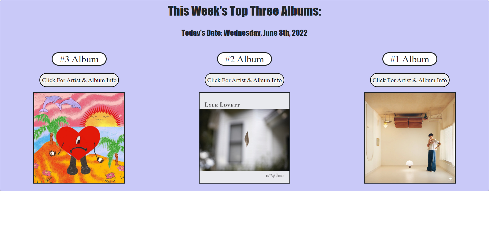

# group-project
## Table of Contents 
 1. [Authors](#authors)
 2. [User Story](#user-story)
 3. [Description](#description)
 4. [Resources](#resources)
 5. [Visuals](#visuals)

## Authors
Justin Stone 

Marquise Allen 

Safwan Islam
## User Story

```
AS AN avid music listener
I WANT to be able to have access to trending albums 
SO THAT I can have knowledge of the current music industry
```
## Description
When the user arrives to the homesceen they see the album covers of the top three albums in the country for that week based on the Audio DB Trending Albums API. They also see the current date based on the Moment.JS application. They then have the option to select between the information for the albums. Once a button is selected the user is met with information such as the album name, artist name, and the year they began creating music. Those will be based on the Audio DB search API.  They will also be greeted with a gif based on that artist's name using the Giphy API. Within each of the pages the user has the option to toggle back to the home page or to the information about the other two albums. The code is set up to work within smaller screens such as phones and tablets. Overall, the user has access to the top music of that given week and information about the artist. The picture below is the homescreen of the website.

## Resources
[LIVE SITE](https://saislam10.github.io/group-project/)

[Github Repo](https://github.com/saislam10/group-project)
## Visuals


